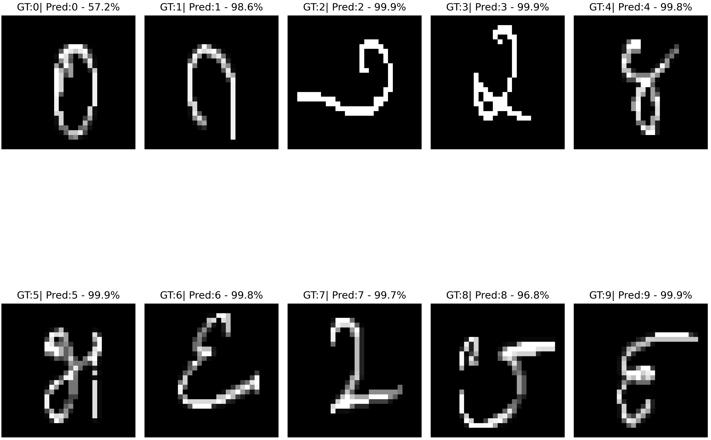

# Binarized Convolution Neural Network

Dataset: [Kannada-MNIST](https://www.kaggle.com/c/Kannada-MNIST)

This project contains Tensorflow-Keras implementations of the BinaryNet and XNORNet papers:

[Binarized Neural Networks: Training Deep Neural Networks with Weights and Activations Constrained to +1 or -1](https://arxiv.org/abs/1602.02830)

[XNOR-Net: ImageNet Classification Using Binary Convolutional Neural Networks](https://arxiv.org/abs/1603.05279)

This repo is fork of [BinaryNet_and_XNORNet](https://github.com/yaysummeriscoming/BinaryNet_and_XNORNet) with modifications to support newer version TF 2.x with TF-Lite.

*Note: TF-Lite support for these model is still in progress.*

## Result
XNOR Net on test dataset

### Contribution is appreciated

